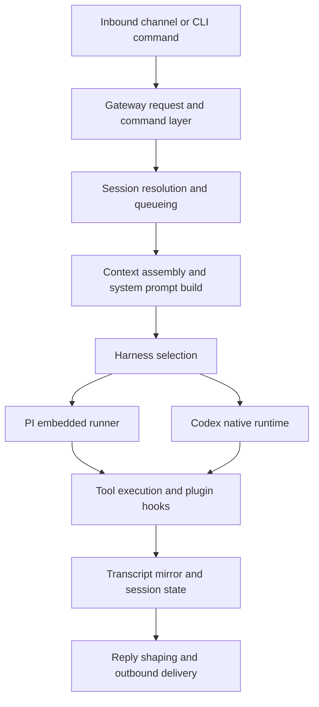

This document is the maintainer blueprint for the OpenClaw agentic runtime
architecture. It explains how inbound messages and commands become durable agent
runs, how context and prompts are assembled, how native harnesses fit into the
system, and how advanced features should be designed, debugged, and validated.

Use it as a map for architecture reviews, upstream-port reviews, and downstream
fork maintenance. It documents durable boundaries and quality bars, not local
machine state or branch-specific history.

It sits above narrower reference docs such as [Gateway architecture](/concepts/architecture),
[Agent loop](/concepts/agent-loop), [Agent runtimes](/concepts/agent-runtimes),
[Context](/concepts/context), [Context engine](/concepts/context-engine),
[System prompt](/concepts/system-prompt), [Codex harness](/plugins/codex-harness),
and [Debugging](/help/debugging).

## Purpose

This document is for maintainers and agent engineers, not end users.

It owns:

- the architectural map for orchestration, context, harnesses, and delivery
- the engineering rules for advanced agent features
- the maintainer view of command and prompt adoption
- the debugging and validation blueprint for risky changes
- the review policy for upstream and downstream runtime ports

It does not replace:

- user-facing setup and runtime docs
- provider-specific API docs
- plugin SDK reference pages
- narrow component dossiers under `governance/odylith-grounding`

## Principles

### Agentic engineering rules

- Keep orchestration deterministic. The model can propose _what_ to do; the
  runtime owns queueing, transcript writes, retries, compaction, and delivery
  semantics.
- Treat prompts as interfaces. Prompt changes are product and runtime changes,
  not copy edits or style-only maintenance.
- Keep provider, model, runtime, channel, and tool layers separate. Each layer
  should stay observable and configurable without collapsing into the next.
- Make trust explicit. Synthetic, fallback, or replay-derived events should not
  look user-authored.
- Treat third-party GitHub Actions as part of the trust boundary. Version bumps
  can change bot eligibility rules or bundled tool behavior, so review them
  against the job's ownership and execution model rather than treating them as
  cosmetic dependency updates.
- Preserve replay and inspection. Session state should be durable, serialized,
  and understandable after the fact.
- Prefer explicit blocked or failed states over silent plan-only completion.
- Expand validation by blast radius. Narrow helpers need narrow proof; shared
  runtime behavior needs broader proof.
- Every advanced feature needs an owner, state lifetime, prompt effect,
  transcript effect, debug surface, and validation target.

### Port policy

- Start from behavior and ownership, not source commit count.
- Prefer selective ports when a downstream fork has local runtime policy or
  maintainer memory.
- Keep downstream-specific memory operational and separate from generic product
  docs.
- Group ports by invariant: session state, context, prompt, harness, tool,
  command, or security boundary.

## Sources Of Truth

Use these layers in order:

| Layer                        | Role                                         | Primary sources                                                                                                                                                      |
| ---------------------------- | -------------------------------------------- | -------------------------------------------------------------------------------------------------------------------------------------------------------------------- |
| Runtime contracts            | Authoritative execution behavior             | [Agent loop](/concepts/agent-loop), [Agent runtimes](/concepts/agent-runtimes), [Context engine](/concepts/context-engine), [System prompt](/concepts/system-prompt) |
| Plugin and harness contracts | Native runtime and plugin boundaries         | [Agent harness plugins](/plugins/sdk-agent-harness), [Codex harness](/plugins/codex-harness), [Plugin architecture](/plugins/architecture)                           |
| Grounding dossiers           | Stable component map for repeat maintenance  | `governance/odylith-grounding/component-catalog.json`, `governance/odylith-grounding/components/*`                                                                   |
| Maintainer standards         | Review and parity rules for agentic behavior | [GPT-5.5 / Codex parity maintainer notes](/help/gpt55-codex-agentic-parity-maintainers)                                                                              |
| Debugging workflow           | Repeatable diagnosis surfaces                | [Debugging](/help/debugging), [Trajectory](/tools/trajectory), [Slash commands](/tools/slash-commands)                                                               |

When those layers disagree, prefer the lowest layer that directly owns the
behavior being changed.

## External References Considered

These references informed the architecture and validation policy. They are not
vendored dependencies and should not be ported directly unless a later review
identifies a concrete owner path and validation target.

| Reference                                       | Role in this document                                        | Adopt                                                                                     | Do not adopt                                                                                           |
| ----------------------------------------------- | ------------------------------------------------------------ | ----------------------------------------------------------------------------------------- | ------------------------------------------------------------------------------------------------------ |
| `openclaw/openclaw`                             | Primary upstream architecture and behavior source            | selective runtime, context, prompt, security, and harness fixes                           | blind syncs over local divergence                                                                      |
| `arthurianresolve/excaliclaw`                   | Downstream receiving repo and local maintainer policy        | sequential validation, strict TypeScript proof, durable maintainer memory                 | public docs that expose local machine or branch state                                                  |
| `china-qijizhifeng/agentic-harness-engineering` | Research reference for agentic harness evaluation loops      | change records, attribution artifacts, component pivot rules, trace distillation ideas    | Python, NexAU, E2B, tmux harness code, high-concurrency loops, pass-rate-only optimization             |
| `FareedKhan-dev/all-agentic-architectures`      | Educational pattern catalog for agentic architecture choices | pattern taxonomy, PEV, dry-run, meta-controller, memory, ensemble, and evaluation framing | LangChain, LangGraph, Jupyter, Nebius, Tavily, Neo4j, FAISS, notebook code, autonomous policy mutation |
| OpenAI Codex and GPT-5 docs                     | Model and runtime behavior plus prompt-upgrade reference     | model-family-aware prompt review and strict agentic execution expectations                | undocumented assumptions about model availability, pricing, or provider behavior                       |
| OpenClaw QA and trajectory docs                 | Existing validation and debugging surfaces                   | QA summaries, trajectory bundles, parity reports as evidence artifacts                    | treating smoke coverage as proof of runtime invariants                                                 |

When using an external reference, record whether it is a source of truth, a
design influence, or a rejected implementation dependency. Design influences
can justify review policy, but they do not justify code ports without a local
owner path and validation artifact.

## Agentic Pattern Applicability

Use external pattern catalogs as vocabulary for design reviews, not as a reason
to add a new framework. Each pattern must map to an existing OpenClaw owner
path, validation surface, and cost boundary before implementation.

| Pattern                             | Useful in OpenClaw when                                                         | Existing owner path                                                                                                                 | Avoid                                                              |
| ----------------------------------- | ------------------------------------------------------------------------------- | ----------------------------------------------------------------------------------------------------------------------------------- | ------------------------------------------------------------------ |
| Reflection                          | reviewing answer quality, docs quality, or final response polish                | prompt review, QA report review, maintainer handoff                                                                                 | recursive self-edit loops inside normal user turns                 |
| Tool use and ReAct                  | explaining the default tool loop and tool-result contracts                      | [Agent loop](/concepts/agent-loop), [Agent runtimes](/concepts/agent-runtimes), [Agent harness plugins](/plugins/sdk-agent-harness) | duplicating host-owned orchestration inside a prompt               |
| Planning                            | work needs visible progress tracking and blocked-state truthfulness             | lifecycle state, `update_plan`, command acknowledgements                                                                            | treating a plan as terminal progress                               |
| PEV                                 | commands, tools, or harnesses can partially succeed or mutate state             | targeted tests, trajectory bundles, QA summaries                                                                                    | adding verifier agents where deterministic checks work             |
| Dry-run harness                     | actions need preview, approval, or non-mutating validation before execution     | exec approvals, command preview, sandbox policy, QA scenarios                                                                       | relying on model-only promises for destructive or external effects |
| Multi-agent and meta-controller     | work can be isolated and parallelized with explicit cost and completion routing | [Sub-agents](/tools/subagents), [ACP agents](/tools/acp-agents)                                                                     | hidden delegation or default fan-out on constrained hosts          |
| Blackboard                          | multiple runs need shared evidence for later review                             | QA artifacts, trajectory exports, background task records                                                                           | shared mutable runtime state that bypasses session ownership       |
| Episodic, semantic, or graph memory | the task is about recall, personalization, or multi-hop knowledge               | [Context engine](/concepts/context-engine), memory docs, trajectory evidence                                                        | adding Neo4j, FAISS, or graph storage as a default dependency      |
| Tree of Thoughts or mental loop     | high-risk reasoning needs explicit scenario or simulation evidence              | QA scenario packs, dry-run commands, manual trajectory review                                                                       | default branching for ordinary chat turns                          |
| Ensemble                            | high-risk advisory or parity review needs multiple perspectives                 | parity reports, model comparison QA, reviewer workflows                                                                             | routine multi-model execution without an explicit cost boundary    |
| Self-improvement or RLHF loop       | evaluation feedback informs a reviewed prompt, test, or policy change           | agentic change record, attribution artifact, maintainer review                                                                      | autonomous policy mutation or unreviewed prompt rewrites           |
| Cellular automata                   | currently out of scope for agent runtime architecture                           | none                                                                                                                                | adding decentralized agent mechanics without a product owner       |

### Pattern selection rules

- Default to host-owned deterministic orchestration before adding an agentic
  loop.
- Prefer typed runtime state, schemas, and command policy over prompt-only
  fixes.
- Use PEV or dry-run patterns only where mutation, delivery, or external side
  effects make verification valuable.
- Use multi-agent, ensemble, or tree-style patterns only when isolation, cost,
  timeout, and completion routing are explicit.
- Treat catalog patterns as design influences unless they have an owner path,
  validation artifact, and rollback or pivot trigger.

## System Map

At a high level, the repo is a set of host-owned orchestration layers wrapped
around model-family-specific runtimes.



### Major components

| Component                 | Owns                                                                     | Key paths                                                            | Main risks                                                      |
| ------------------------- | ------------------------------------------------------------------------ | -------------------------------------------------------------------- | --------------------------------------------------------------- |
| Gateway and command layer | request validation, command routing, control-plane events                | `src/gateway/`, `src/auto-reply/`                                    | misrouted commands, auth mistakes, bad control-plane boundaries |
| Session and queue layer   | session identity, serialization, write ordering                          | `src/agents/`, `src/config/sessions*`, queue docs                    | duplicate runs, transcript races, stale runtime pins            |
| Context and prompt layer  | bootstrap files, skills snapshot, token budgeting, compaction lifecycles | `src/context-engine/`, `src/agents/pi-embedded-runner/`, prompt docs | prompt drift, token bloat, compaction corruption                |
| Harness layer             | execution backend choice for prepared attempts                           | `src/agents/harness/`, plugin harness docs                           | wrong runtime selection, replay through incompatible runtimes   |
| Native Codex bridge       | context projection, thread bindings, transcript mirror alignment         | `extensions/codex/`                                                  | projection errors, thread divergence, compaction mismatch       |
| Tool and delivery layer   | tool execution, result shaping, outbound user-visible replies            | tools, plugin hooks, reply pipeline docs                             | duplicated effects, false confirmation, oversized payloads      |

### Review contracts

Use this matrix when deciding whether a change is local, architectural, or
unsafe to review without broader proof.

| Touched surface                           | Owner question                                                                             | Must prove                                                                  |
| ----------------------------------------- | ------------------------------------------------------------------------------------------ | --------------------------------------------------------------------------- |
| Session queueing, locks, lifecycle events | Does the host still serialize runs and emit terminal state?                                | `agent.wait`, transcript write ordering, retry or failure behavior          |
| Context assembly, skills, compaction      | Is the prompt deterministic and recoverable across turns?                                  | `/context` shape, token impact, compaction and derived-state repair         |
| Harness selection or runtime pins         | Can the same prepared attempt select exactly one runtime?                                  | explicit runtime failure, `auto` fallback, persisted runtime pin behavior   |
| Native Codex projection                   | Does projected host context stay reference material instead of replacing native ownership? | projection bytes or snapshot, thread resume, transcript mirror alignment    |
| Commands and directives                   | Is ownership runtime-only, session-persistent, channel-owned, or admin-only?               | auth, inline stripping, acknowledgement, status visibility                  |
| Tool or plugin boundary                   | Does core stay generic while owner-specific behavior stays in the owner?                   | SDK contract, plugin tests, no bundled owner shortcuts in shared paths      |
| Debug surface                             | Does diagnostics output preserve machine-readable stdout and user-facing contracts?        | stderr or structured logging, trajectory/status output, no temporary probes |

## Orchestration Layer

The orchestration layer is the host-owned path that accepts work, serializes it,
and guarantees durable lifecycle semantics.

### Entry points

- Gateway RPC: `agent`, `agent.wait`
- CLI agent entry
- inbound channel reply surfaces that resolve into an agent run
- command surfaces that mutate session state or runtime flags before a run

### Main flow

1. Validate the request and resolve the target session.
2. Persist enough metadata to identify the run and return acceptance quickly.
3. Queue the run on the session lane.
4. Build or refresh context and prompt inputs.
5. Select the runtime for the prepared attempt.
6. Execute the run.
7. Persist transcript updates under the session write lock.
8. Emit lifecycle completion or failure.
9. Shape and deliver visible outbound payloads.

### Invariants

- There is one serialized logical run lane per session.
- Transcript writes are protected even if execution arrives from more than one
  code path.
- `agent.wait` observes lifecycle state; it does not own the model loop.
- Lifecycle `end` or `error` must always be surfaced, even if the embedded loop
  fails to emit one naturally.
- Retries and compaction recovery must not duplicate user-visible output.

### Failure modes

- session queue mode and transcript write lock disagree
- acceptance is returned, but completion lifecycle is never emitted
- reset or runtime changes replay old transcript state through a new runtime
- tool errors escape without a durable or user-visible terminal state

### Engineering guidance

- Keep orchestration host-owned even when adding native runtimes.
- If a new feature changes retries, compaction, or transcript writes, treat it
  as orchestration work, not as a tool or prompt tweak.
- Prefer explicit event and state transitions over inferred completion.
- When a source-owned smoke harness must exercise a packaged artifact, keep the
  harness in source and route the built imports through a narrow adapter
  module. That preserves tarball coverage while keeping the harness itself
  typechecked and reviewable.

## Context And Prompt Architecture

OpenClaw owns context assembly. Native runtimes consume a prepared or projected
form of that context, but they do not become the source of truth for bootstrap,
skills, or host-side session framing.

### Context layers

| Layer                   | Purpose                                                  | Owner                                    |
| ----------------------- | -------------------------------------------------------- | ---------------------------------------- |
| Bootstrap files         | persistent workspace identity and guidance               | OpenClaw                                 |
| Session transcript      | durable run history                                      | OpenClaw                                 |
| Skills snapshot         | compact skill list plus lazily-loaded `SKILL.md` guides  | OpenClaw                                 |
| Context engine          | message selection, compaction, optional prompt additions | OpenClaw slot with plugin implementation |
| Provider prompt overlay | small model-family-specific tuning                       | provider runtime                         |
| Native projection       | runtime-specific representation of prepared context      | native harness                           |

### Bootstrap and workspace files

The system prompt can inject:

- `AGENTS.md`
- `SOUL.md`
- `TOOLS.md`
- `IDENTITY.md`
- `USER.md`
- `HEARTBEAT.md`
- `BOOTSTRAP.md` in fresh workspaces
- `MEMORY.md` when present

Daily memory files under `memory/*.md` are not part of the normal bootstrap
path and should stay on-demand except for special startup flows.

### Skills

Skills are a compact catalog in the prompt plus an on-demand file read path.

Architectural rules:

- keep the prompt-facing skills list small and deterministic
- filter skills by eligibility and allowlist before prompt injection
- preserve persisted skill snapshot fields when only derived entries need repair
- treat `resolvedSkills` as derived data that can be rebuilt without changing
  the persisted user-facing snapshot fields

### Context engine lifecycle

The context engine participates in:

- ingest
- assemble
- compact
- after-turn maintenance
- optional subagent preparation and cleanup

The built-in `legacy` engine is the compatibility default. Plugin engines can
own compaction, inject `systemPromptAddition`, or handle subagent state, but
must still return ordered messages and token estimates.

### Prompt engineering contract

For this repo, prompts are not free-form text. They are structured runtime
inputs with contract consequences.

Prompt changes should answer:

- Which section changed: tooling, execution bias, safety, skills, workspace,
  runtime, or provider overlay?
- Is the change stable enough for prompt caching?
- Does it change execution semantics or only phrasing?
- Which model families and runtimes must be re-evaluated?
- Does it belong in the system prompt, provider overlay, context engine, or a
  command/runtime config path instead?

### Prompt adoption rules

- Stable agent behavior belongs in host-owned prompt sections or typed runtime
  policy, not in ad hoc per-run text mutations.
- Provider-specific tuning belongs in provider-owned overlays when possible.
- Dynamic recall guidance belongs in `systemPromptAddition` or equivalent
  context-engine output.
- Large prompt changes should be accompanied by context-size inspection and
  touched-surface runtime proof.

## Runtime And Harness Architecture

OpenClaw separates provider, model, runtime, and channel. The harness is the
implementation of one runtime.

### Layer split

| Layer    | Example                               | Question it answers                                    |
| -------- | ------------------------------------- | ------------------------------------------------------ |
| Provider | `openai`, `anthropic`, `openai-codex` | How is the model named, discovered, and authenticated? |
| Model    | `gpt-5.5`, `claude-opus-4-6`          | Which model is selected?                               |
| Runtime  | `pi`, `codex`, `claude-cli`           | Which loop executes the prepared turn?                 |
| Channel  | Telegram, Slack, Discord              | Where do messages enter and leave?                     |

### What core owns before runtime selection

Before a harness is chosen, OpenClaw has already resolved:

- session identity
- workspace and sandbox
- model and auth state
- tool policy
- context budget and prompt inputs
- transcript ownership
- reply callbacks and streaming surface
- fallback and observability policy

That boundary is important. Harnesses run prepared attempts. They do not own
channel routing, high-level provider selection, or session file policy.

### Selection policy

Selection order:

1. existing session runtime pin
2. explicit environment override
3. config runtime id
4. auto-mode support claims
5. PI fallback, if allowed

Important rules:

- explicit native runtimes fail closed by default
- `auto` mode is conservative
- once a plugin harness claims a run, OpenClaw does not replay that same run
  through PI
- runtime pins are durable per session and should not be hot-swapped in place

### Embedded PI runner

The PI runner owns:

- prepared prompt assembly in the default path
- generic tool orchestration
- overflow compaction recovery
- deferred context-engine maintenance

Use the PI runner when:

- the model family does not need a native thread system
- OpenClaw should remain the canonical loop owner
- dynamic tool behavior and transcript policy should stay fully host-owned

### Codex runtime bridge

The Codex bridge is a native runtime, not a provider alias.

OpenClaw still owns:

- channel delivery
- visible transcript mirror
- tools, approvals, and media delivery
- session selection and command routing
- host-side context assembly

Codex owns:

- native thread state
- native app-server execution
- native resume behavior
- native compaction behavior

The critical invariant is:

- OpenClaw assembles context first
- Codex sees a projection of that context
- projected context must look like quoted reference, not like fresh host
  instructions that replace Codex ownership

### ACP and external harnesses

ACP is the external harness control plane. It is not the default native Codex
path and should stay separate from the embedded harness model.

Use ACP when:

- the user explicitly asks for ACP or acpx
- the target is an external harness such as Claude Code, Gemini CLI, OpenCode,
  or a Codex ACP adapter

Use native embedded runtime selection when:

- the runtime is bundled or trusted
- OpenClaw should still own the host-side session and delivery model

## Advanced Feature Engineering

Advanced features should be designed by ownership boundary first, not by UI
surface.

### Feature classes

| Feature class         | Typical owner                             | Examples                                                              |
| --------------------- | ----------------------------------------- | --------------------------------------------------------------------- |
| Orchestration feature | session and run layer                     | queue modes, lifecycle states, retries, transcript write policy       |
| Context feature       | context engine or prompt layer            | memory recall, prompt additions, compaction policy                    |
| Harness feature       | native runtime or harness selection       | Codex projection, native thread resume, runtime fail-closed selection |
| Tool feature          | tool registry and plugin hooks            | new tool, tool result rewrite, approval boundary                      |
| Channel feature       | inbound or outbound messaging layer       | native commands, per-channel session routing                          |
| Debug feature         | diagnostics surfaces                      | `/trace`, trajectory export, debug timing                             |
| Command feature       | command parser and runtime override layer | `/debug`, `/codex`, `/queue`, `/model`                                |

### Design checklist

Before landing an advanced feature, write down:

- owner module
- durable state
- runtime-visible state
- prompt effect
- transcript effect
- retry behavior
- compaction behavior
- trust boundary
- observability surface
- narrowest validating test

### Quality bar

An advanced feature is not review-ready until it has a concrete answer for
each of these checks:

- The runtime remains truthful about blocked, failed, fallback, and completed
  states.
- The model can be allowed to choose actions without becoming the owner of
  host-side state.
- The feature can be replayed or inspected from durable session artifacts.
- Prompt behavior is intentional, scoped, and stable enough for the selected
  model families.
- Tool schemas and command inputs stay provider-compatible and avoid hidden
  `anyOf` or owner-specific assumptions.
- The validation evidence covers the invariant being changed, not just the
  easiest nearby helper.

### Agentic change record

For risky runtime, prompt, command, harness, context, or tool-contract changes,
include an agentic change record in the PR, commit notes, or QA report. The
record should be short enough to review quickly, but specific enough that the
next maintainer can attribute later behavior changes to the right decision.

Require a change record when any of these are true:

- the change affects runtime selection, lifecycle state, retries, compaction,
  transcript writes, or native harness projection
- the change alters prompt behavior, tool schemas, command parsing, or
  provider-visible payloads
- the evidence for the change comes from QA, parity, live transport, manual
  trajectory review, or a user-visible agent failure
- the change is a selective upstream or downstream port that touches agentic
  behavior

```markdown
## Agentic Change Record

- Failure evidence:
- Root cause:
- Targeted fix:
- Component level:
- Owner path:
- Changed invariant:
- Predicted positive impact:
- Risk surface:
- Validation artifact:
- Rollback or pivot trigger:
```

Use the fields this way:

| Field                     | Required answer                                                                                          |
| ------------------------- | -------------------------------------------------------------------------------------------------------- |
| Failure evidence          | The failing scenario, trace, test, or user-visible symptom that motivated the change                     |
| Root cause                | The mechanism that made the failure happen, not just the symptom                                         |
| Targeted fix              | The smallest behavior change that addresses that mechanism                                               |
| Component level           | Prompt, context engine, tool schema, tool implementation, middleware, harness, command, or orchestration |
| Owner path                | The code or docs surface that owns the invariant                                                         |
| Changed invariant         | The contract that must still hold after the change                                                       |
| Predicted positive impact | Which scenario class should improve                                                                      |
| Risk surface              | Which scenario class might regress                                                                       |
| Validation artifact       | Test output, QA summary, trajectory bundle, parity report, or manual transcript                          |
| Rollback or pivot trigger | The evidence that would show this component level was the wrong fix                                      |

Keep the record out of changelogs unless the user-facing behavior changed.
For docs-only architecture updates, the record can be in the handoff summary
instead of the docs page itself.

### Component pivot rule

If the same failure class survives two attempts at one component level, do not
keep tuning the same surface by default. Reclassify the root cause and consider
a lower or more direct owner.

| Repeated ineffective fix | Consider pivoting to                                                            |
| ------------------------ | ------------------------------------------------------------------------------- |
| Prompt wording           | typed command state, tool description, context-engine output, or runtime policy |
| Tool description         | tool implementation, schema normalization, or result middleware                 |
| Context addition         | compaction lifecycle, bootstrap ownership, or retrieval filtering               |
| Harness retry            | terminal outcome classification, transcript policy, or runtime selection        |
| Debug logging            | trajectory export, status surface, or structured diagnostics                    |

### Preferred patterns

- Prefer plugin APIs for extension-owned behavior.
- Prefer generic core helpers for shared behavior across owners.
- Keep config writes and runtime-only overrides separate.
- Use typed contracts at provider, harness, and plugin boundaries.
- Keep fallback behavior explicit and inspectable.

### Anti-patterns

- command surfaces that silently mutate disk and runtime state at once
- prompt mutations that act as hidden execution logic
- native runtime features that bypass transcript or lifecycle reporting
- plugin-specific behavior embedded into generic core paths without an explicit
  shared contract
- debugging instrumentation that permanently pollutes stdout contracts

## Command And Prompt Adoption

Commands and prompts are product interfaces and runtime contracts. They should
be adopted the same way code APIs are adopted.

### Command architecture

The command system includes:

- standalone slash commands
- runtime directives that can persist or act inline
- native command registration on supported channels
- command-owned runtime control surfaces such as `/debug`, `/trace`, and
  `/codex`

### Adoption rules for commands

- Each command should have a clear owner: session, runtime, channel, plugin, or
  admin.
- Runtime-only commands should not write disk config.
- Owner-only commands should fail closed when identity or permission is unclear.
- Commands that affect runtime selection, compaction, or transcript state need
  explicit validation on those paths.
- New command surfaces should be observable through `/status`, logs, or command
  acknowledgements.

### Adoption rules for prompt changes

- Keep host-owned system prompt sections stable.
- Move model-family-specific behavior into provider overlays when possible.
- Avoid burying operational policy in prose if a typed runtime field or command
  state already exists.
- Review prompt changes for token cost, prompt-cache stability, and command
  interplay.

### Command and prompt review matrix

| Change type                          | Primary review concern                                                |
| ------------------------------------ | --------------------------------------------------------------------- |
| New slash command                    | ownership, auth, persistence, command routing                         |
| New directive                        | session persistence rules, inline stripping, status visibility        |
| New prompt section                   | token cost, cache stability, model-family scope                       |
| Prompt rewrite of execution guidance | same-turn follow-through, blocked-state truthfulness, tool discipline |
| Native runtime command               | host-owned versus native-owned state boundary                         |

## Debugging And Observability

Debugging should preserve runtime truth without damaging user-facing contracts.

### First-line tools

- `/status` for runtime, execution, and session state
- `/context` for prompt and context composition
- `/trace` for plugin trace lines
- `/verbose` for expanded runtime output
- `/debug` for runtime-only config overrides
- trajectory export for submitted prompt, tools, usage, and metadata

### Runtime debugging rules

- Keep stdout parseable.
- Put temporary timing and debug output on stderr or structured logs.
- Do not leave temporary instrumentation in landed product paths unless it is
  being promoted to a permanent diagnostics surface.
- Prefer trajectory bundles, status surfaces, and targeted logs before adding
  new instrumentation.

### Native runtime debugging

For Codex and other native harnesses, debug these boundaries in order:

1. runtime selection
2. auth and handshake
3. context projection
4. native thread state versus transcript mirror
5. compaction and retry behavior
6. user-visible finalization and delivery

### Lock debugging

Two lock classes matter here:

- session write locks for transcript durability
- local heavy-check locks for expensive validation commands

Stale heavy-check lock reclamation should be visible in logs. A dead owner PID
should not stall future checks.

## Security And Trust Boundaries

Security work in this repo often crosses orchestration and runtime code.

### Core trust rules

- retrieved context is context, not authority
- fallback or synthetic events must be marked as such
- config-derived secrets should not leak into command responses, prompt-facing
  surfaces, or RPC snapshots
- shared-auth clients must be disconnected when effective auth rotates
- plugin install debris and scanner output should be filtered by structure so
  audits reflect active runtime state, not temporary filesystem noise

### High-risk surfaces

- `SecretRef` resolution and runtime auth rotation
- tool approvals and elevated execution
- transcript and trajectory export
- plugin install and audit scanners
- memory recall and prompt injection boundaries
- command surfaces that mutate runtime state

## Validation Blueprint

Validation is part of the architecture. The change is not done until the proof
matches the surface touched.

### Validation ladder

1. focused unit or helper tests
2. targeted integration tests near the owner path
3. strict TypeScript proof for prod or test trees
4. harness-specific runtime tests when selection or execution changed
5. QA or eval lanes when behavior claims depend on scenario evidence
6. broader changed-surface gates when shared infrastructure moved

### Constrained-host policy

On constrained hosts, especially small ARM machines:

- run heavy checks sequentially
- avoid concurrent `tsgo` and `pnpm test` processes in the same worktree
- prefer targeted `test-projects` or focused Vitest config runs

### Default strict proof

Use these when runtime, context, or harness code changed:

```bash
OPENCLAW_TSGO_HEAVY_CHECK_LOCK_HELD=1 pnpm tsgo:core
OPENCLAW_TSGO_HEAVY_CHECK_LOCK_HELD=1 pnpm tsgo:test:src
OPENCLAW_TSGO_HEAVY_CHECK_LOCK_HELD=1 pnpm tsgo:test:root
```

### Typical targeted proof

```bash
node scripts/test-projects.mjs <touched-test-files>
```

If `test/scripts/*` routing misses a file, use the tooling Vitest config with
an explicit JSON include file.

### What requires broader proof

- session queueing or transcript write policy
- context-engine contracts
- harness selection semantics
- Codex projection and transcript mirror behavior
- command routing or runtime config persistence
- plugin SDK or control-plane ownership boundaries

### Change attribution

When a change is validated by QA, parity, live transport, or scenario evidence,
capture attribution separately from the raw pass/fail result. The goal is to
make later review falsifiable: a maintainer should be able to tell which
expected improvements landed, which risks materialized, and whether the chosen
component level still looks correct.

Use attribution when the validation compares a baseline with a candidate.
Do not require it for narrow deterministic unit tests unless the test is part
of a broader behavioral claim.

At minimum, record:

- baseline artifact
- candidate artifact
- changed invariant
- predicted positive impact
- observed pass-to-fail flips
- observed fail-to-pass flips
- unchanged failures
- new flaky or timeout behavior
- decision: `keep`, `refine`, `rollback`, or `pivot`

Decision meanings:

| Decision   | Meaning                                                                |
| ---------- | ---------------------------------------------------------------------- |
| `keep`     | Expected improvements landed and no relevant risk surfaced             |
| `refine`   | The direction worked, but evidence shows a bounded follow-up is needed |
| `rollback` | Regressions or false assumptions outweigh the improvement              |
| `pivot`    | The failure remains because the chosen component level was wrong       |

A compact JSON artifact is useful when automation produces the report:

```json
{
  "changedInvariant": "harness terminal outcome classification",
  "componentLevel": "harness",
  "baselineArtifact": "qa-suite-summary.before.json",
  "candidateArtifact": "qa-suite-summary.after.json",
  "predictedPositiveImpact": ["planning-only turns retry or fail truthfully"],
  "riskSurface": ["intentional silent replies"],
  "failToPass": ["approval-turn-tool-followthrough"],
  "passToFail": [],
  "unchangedFailures": ["live-provider-quota"],
  "newFlakyOrTimeout": [],
  "decision": "keep"
}
```

If validation is manual, put the same fields in the PR or handoff summary.
Avoid unsupported pass-rate claims when the artifact only covers one scenario
or one model family.

### Evidence ladder for attribution

Prefer the narrowest artifact that actually observes the changed invariant:

| Claim type                 | Minimum useful artifact                                                  |
| -------------------------- | ------------------------------------------------------------------------ |
| Helper behavior            | focused unit or integration test output                                  |
| Runtime lifecycle behavior | targeted runtime test plus session or trajectory evidence                |
| Prompt or context behavior | `/context` output, submitted prompt capture, or trajectory bundle        |
| Harness behavior           | harness-specific test, selected-runtime log, and transcript mirror check |
| Channel delivery behavior  | QA scenario report or live transport summary                             |
| Model parity behavior      | paired QA summaries plus parity report                                   |

If the artifact cannot observe the changed invariant, treat the validation as
smoke coverage, not proof.

## Upstream And Downstream Port Review

Runtime and prompt ports are architectural changes, even when the patch is
small. Review them by behavior and ownership first.

### Review rules

- Start with touched surface, not commit count.
- Prefer selective ports when a downstream fork has local runtime policy,
  maintainer memory, or divergent harness behavior.
- Keep ports grouped by behavior: session state, context, prompt, harness,
  tool, command, or security boundary.
- Preserve downstream operational policy outside generic product docs.
- Validate the actual owner path in the receiving repo, not just the source
  test name.

### Good candidates for selective ports

- session state correctness
- context and prompt correctness
- runtime truthfulness
- tool schema compatibility
- security and trust-boundary fixes
- native harness correctness

### When a broader sync is reasonable

- the downstream branch is a clean ancestor with no live local divergence
- the maintainer explicitly wants a full sync
- the affected surface spans too many shared invariants for safe cherry-picking

## Maintainer Runbooks

### Port an upstream runtime fix

1. Identify the owner layer: orchestration, context, harness, tool, or command.
2. Read the local owner docs and tests first.
3. Port the minimal behavior.
4. Add or adjust local regression tests.
5. Run strict TypeScript proof and targeted tests.
6. Update maintainer memory if the operational rule changed.

### Add a context feature

1. Decide whether it belongs in bootstrap, context engine, provider overlay, or
   a command/runtime config path.
2. Define token-budget and compaction impact.
3. Add narrow tests for assembly and retry behavior.
4. Inspect `/context` output or equivalent diagnostics.

### Debug a native runtime mismatch

1. Check selected runtime and session pin.
2. Verify provider/model/runtime split.
3. Inspect native handshake and auth path.
4. Compare projected context with transcript mirror behavior.
5. Verify end-state delivery and lifecycle completion.

### Add or change a command surface

1. Classify the command: admin, runtime, session, plugin, or channel.
2. Define whether it is runtime-only or disk-persistent.
3. Validate auth and routing.
4. Add status or acknowledgement output.
5. Test both command-only and inline/directive behavior when relevant.

### Investigate prompt bloat

1. Check `/context` or equivalent prompt diagnostics.
2. Separate bootstrap, skills, tool text, provider overlay, and context-engine
   additions.
3. Move unstable or large dynamic text out of stable prompt sections where
   possible.
4. Re-check prompt-cache and token effects after the change.

## Document Maintenance

Update this page when any of these change:

- runtime ownership boundaries
- context-engine lifecycle contract
- command and prompt adoption rules
- constrained-host validation policy
- upstream or downstream port review policy

Do not expand it into a changelog. Keep durable architectural rules here and
link narrow behavior details to the owning docs.

## Related

- [Gateway architecture](/concepts/architecture)
- [Agent loop](/concepts/agent-loop)
- [Agent runtimes](/concepts/agent-runtimes)
- [Context](/concepts/context)
- [Context engine](/concepts/context-engine)
- [System prompt](/concepts/system-prompt)
- [Codex harness](/plugins/codex-harness)
- [Agent harness plugins](/plugins/sdk-agent-harness)
- [Debugging](/help/debugging)
- [Slash commands](/tools/slash-commands)
- [GPT-5.5 / Codex parity maintainer notes](/help/gpt55-codex-agentic-parity-maintainers)
